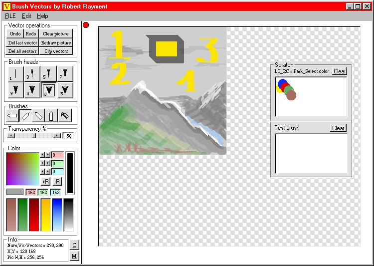



## Brush Vectors\(Fin\)\)

### Description

Brush Vectors by Robert Rayment. (Added binary input/output. Fast version, see Help for info on Fast redraw.) This is a vector drawing program using brushes with up to 8 widths, 4 directions, color & transparency. A brush stroke is started with a left-click(or space bar), move mouse to draw & left-click(or space bar) to end it. Each stroke is stored in a vector array which can be saved to a file. Colors can be parked and also saved to a file. The advantage of vectors is that they are full 24-bit color can be stretched/shrunk to a new canavs size. File format can be ASCII (.vec) or binary (.veb). Vec files are usually much smaller than BMP and veb files often smaller than GIF or JPEG. There aren't many aids to drawing yet apart from a fill tool and Shift & Ctrl keying to force vertical & horizontal drawing. So it needs some skill to produce nice pictures. Undo/Redo is almost unlimited, vectors can be deleted from the last drawn or clipped down to the last undo. Deleting any individual vector is not included yet. Important to read the help file to get the most out of this prog. (exe tested on WinXP), Win98, Zip 48KB.
 
### More Info
 
Just run, read help.

Pictures

             |
---                |---
**Submitted On**   |2003-09-12 15:58:16
**By**             |[Robert Rayment](https://github.com/Planet-Source-Code/PSCIndex/blob/master/ByAuthor/robert-rayment.md)
**Level**          |Intermediate
**User Rating**    |4.8 (134 globes from 28 users)
**Compatibility**  |VB 6\.0
**Category**       |[Complete Applications](https://github.com/Planet-Source-Code/PSCIndex/blob/master/ByCategory/complete-applications__1-27.md)
**World**          |[Visual Basic](https://github.com/Planet-Source-Code/PSCIndex/blob/master/ByWorld/visual-basic.md)
**Archive File**   |[Brush\_Vect16568910112003\.zip](https://github.com/Planet-Source-Code/robert-rayment-brush-vectors-fin__1-48168/archive/master.zip)

### API Declarations

See prog

